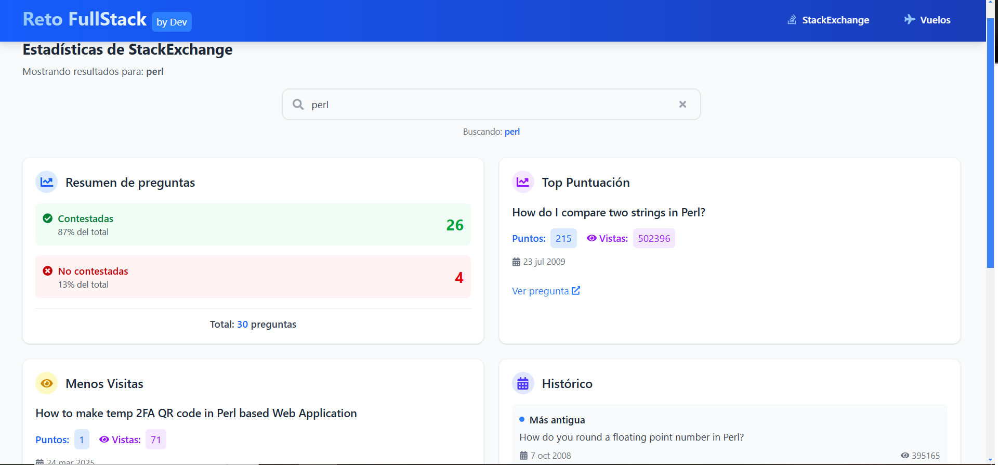
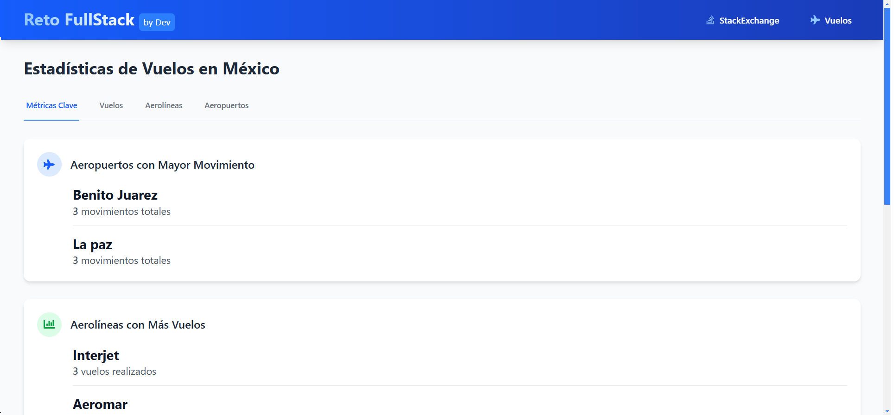

# **Prueba Técnica FullStack - Mecate.mx**  

🚀 **Backend en Flask (Arquitectura por Capas)** | **Frontend en React + TypeScript + Vite** | **Base de Datos: PostgreSQL**  

## **📌 Descripción del Proyecto**  
Este proyecto es una prueba técnica desarrollada para **Mecate.mx**, donde se implementó:  

✅ **Backend**:  
- **Flask** con arquitectura por capas (routes, services, repositories)  
- **API REST** siguiendo el enunciado con funcionalidad extendida (CRUD completo)  
- **Swagger UI** para documentación interactiva  
- **PostgreSQL** como base de datos relacional  
 

✅ **Frontend**:  
- **Vite + React + TypeScript** para máxima eficiencia  
- **Tailwind CSS** para estilos sin dependencias externas  
- **Dos vistas principales**:  
  - 📊 Estadísticas de StackOverflow (API StackExchange)  
  - ✈️ Métricas de vuelos en México (datos simulados)  
- **Skeleton Loaders** para mejor experiencia de usuario  

## **⚡ Instalación Rápida**  

### **Requisitos**  
- Docker y Docker Compose instalados  
- Puertos disponibles: 5173 (Frontend), 5000 (Backend), 5432 (PostgreSQL)  

```bash
git clone https://github.com/stevenjaimes/prueba-tecnica-fullstack.git
cd prueba-tecnica-fullstack
docker-compose up --build 
```

## **🔌 Acceso**  
| Servicio       | URL                                  | Credenciales (si aplica)       |
|----------------|--------------------------------------|-------------------------------|
| Frontend       | [http://localhost:5173](http://localhost:5173) | -                            |
| Backend API    | [http://localhost:5000](http://localhost:5000) | -                            |
| Swagger Docs   | [http://localhost:5000/api/docs](http://localhost:5000/api/docs) | -                            |
| PostgreSQL     | `puerto: 5432`                       | Ver `docker-compose.yml`      |
| PGAdmin (opcional) | [http://localhost:5050](http://localhost:5050) | `admin@example.com`/`password` |

## **📂 Estructura del Proyecto**  
```bash
prueba-tecnica-fullstack/
FLIGHT-STACK
├── backend/
│   ├── app/
│   │   ├── __pycache__/
│   │   ├── api/
│   │   ├── domain/
│   │   ├── infrastructure/
│   │   ├── migrations/
│   │   ├── venv/
│   │   ├── __init__.py
│   │   ├── extensions.py
│   │   ├── .env
│   │   ├── Dockerfile
│   │   ├── init_db.py
│   │   ├── requirements.txt
│   │   └── run.py
│   └── (otros archivos backend si los hay)
└── frontend/
│   ├── node_modules/
│   ├── public/
│   ├── screenshots/
│   ├── src/
│   ├── .gitignore
│   ├── Dockerfile
│   ├── eslint.config.js
│   ├── index.html
│   └── package-lock.json
└──  docker-compose.yml   # Orquestación
```

## 🖼 **Capturas del Proyecto**

<div align="center">
  <div style="display: flex; flex-wrap: wrap; justify-content: center; gap: 20px; margin: 20px 0;">
    <div style="flex: 1; min-width: 300px;">
      <h3>StackOverflow Stats</h3>
      
    </div>
    <div style="flex: 1; min-width: 300px;">
      <h3>Métricas de Vuelos</h3>
      
    </div>
  </div>
</div>

## ✨ **Extras Implementados**

### Backend
- **Endpoints CRUD completos** (más allá de solo consultas)
- **Validación de datos** 

### Frontend
- **Skeleton Loading** para mejor experiencia durante carga
- **Diseño responsive** con breakpoints para móvil/tablet/desktop
- **Manejo de errores** con notificaciones visuales

### DevOps
- **Docker optimizado** con multi-stage builds


## 🙏 **Agradecimientos**

Quiero expresar mi sincero agradecimiento a **Mecate.mx** por esta oportunidad. Este proyecto representó un desafío técnico enriquecedor que me permitió:

- Profundizar en arquitecturas limpias con Flask
- Optimizar la integración entre frontend y backend
- Implementar buenas prácticas de Dockerización


